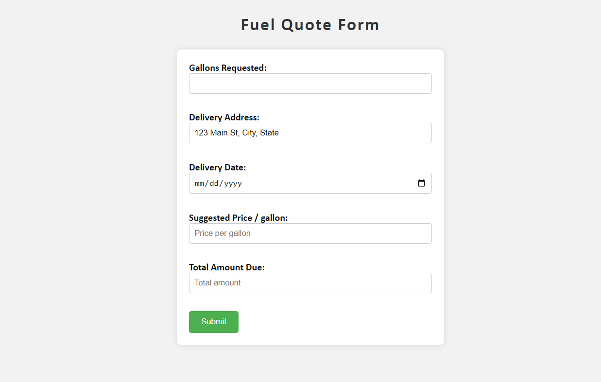
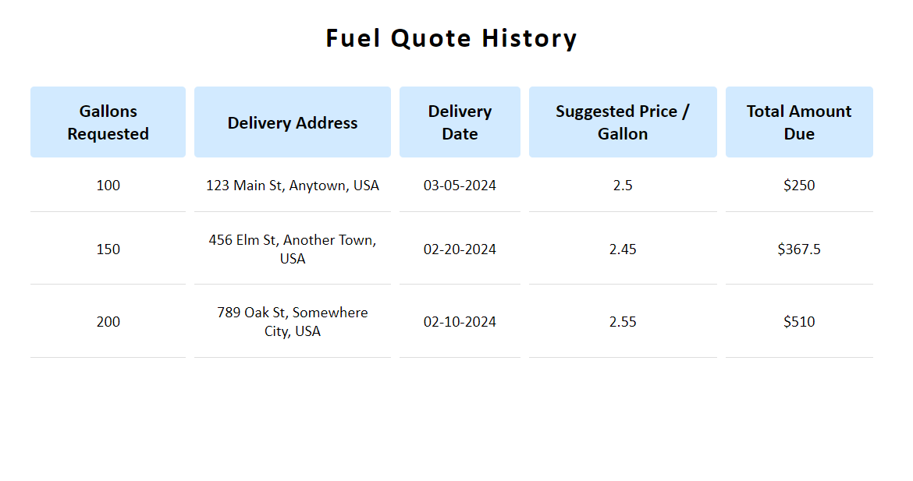

# Fuel Rate Predictor Application

A software application designed to predict fuel rates based on various criteria such as client location, history, gallons requested, and company profit margin.

 

### ☆ ──── Technologies ──── ☆

• HTML  
• CSS  
• Javascript  
• Node.js  
• Jest  
 

### ☆ ──── Features ──── ☆

• **Client Authentication:**  
&nbsp;&nbsp;&nbsp;&nbsp;• Enables users to securely log in to the system, with new users able to register for access.

• **Client Profile Management:**  
&nbsp;&nbsp;&nbsp;&nbsp;• Facilitates the completion of user profiles post-registration, ensuring accurate data for quote generation.

• **Fuel Quote Form:**  
&nbsp;&nbsp;&nbsp;&nbsp;• Allows users to input necessary information for fuel rate prediction, with a pricing module that calculates rates and total costs.

• **Fuel Quote History:**  
&nbsp;&nbsp;&nbsp;&nbsp;• Stores a history of quotes for each client, providing easy access to past transactions.

• **Backend Modules:**  
&nbsp;&nbsp;&nbsp;&nbsp;• Includes login, client profile management, fuel quote management, and pricing calculation modules for efficient backend functionality.

• **Database Integration:**  
&nbsp;&nbsp;&nbsp;&nbsp;• Utilizes a database with tables for user credentials, client information, fuel quotes, and additional data as required for seamless data management.

• **Code Coverage:**  
&nbsp;&nbsp;&nbsp;&nbsp;• The project includes 80% code coverage. Tests are conducted using Jest.

 

### ☆ ──── Screenshots ──── ☆

 

    
    

  
